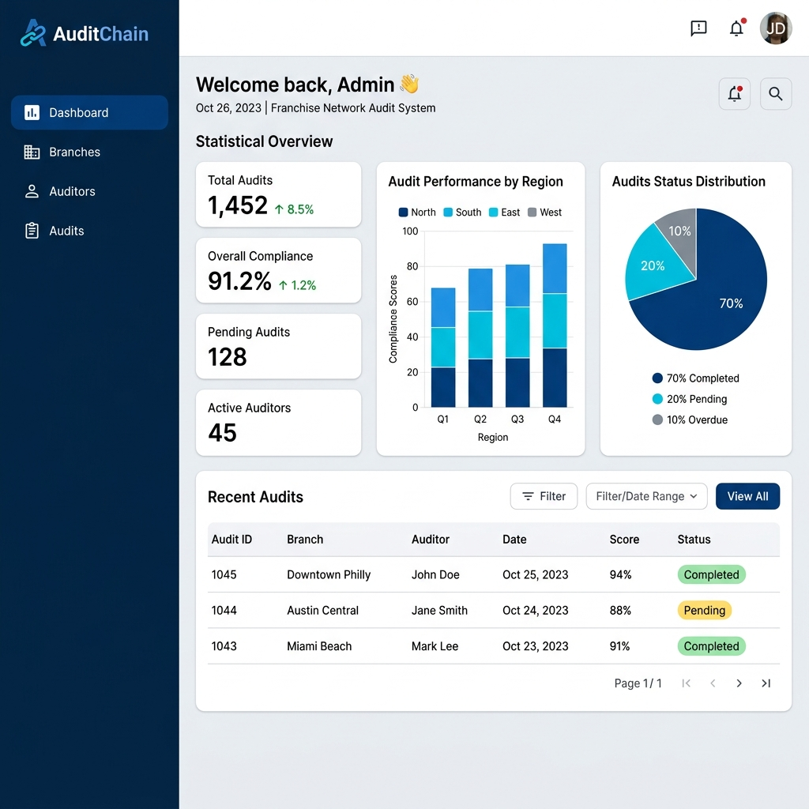
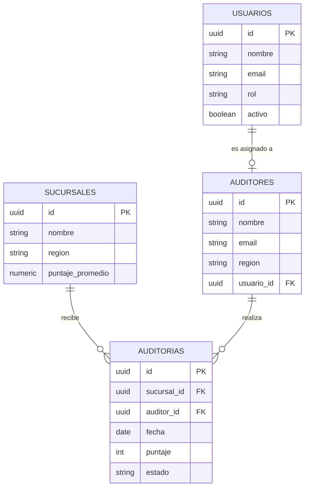

# 🔐 AuditChain — Sistema de Auditoría para Franquicias



**AuditChain** es una plataforma integral diseñada para la gestión y seguimiento de auditorías en redes de franquicias y cadenas comerciales. Permite a las empresas mantener estándares de calidad consistentes a través de una supervisión detallada de sus sucursales, el desempeño de sus auditores y la ejecución de planes de mejora.

---

## 🚀 Características Principales

-   **📊 Dashboard Estadístico:** Visualización en tiempo real del cumplimiento por región y estado de las auditorías.
-   **🏢 Gestión de Sucursales:** Control centralizado de locales, ubicaciones y puntajes históricos.
-   **👤 Control de Roles:** Administración de usuarios con perfiles diferenciados (Administradores y Auditores).
-   **📝 Sistema de Auditorías:** Creación, ejecución y seguimiento de auditorías con scoring numérico y notas detalladas.
-   **📱 Interfaz Moderna:** Desarrollada con Material 3 para una experiencia de usuario fluida y profesional en la web.

---

## 🛠️ Stack Tecnológico

El proyecto utiliza una arquitectura moderna basada en microservicios y contenedores:

-   **Frontend:** [Flutter Web](https://flutter.dev) - UI reactiva y multiplataforma.
-   **Backend:** [FastAPI](https://fastapi.tiangolo.com) - API REST de alto rendimiento en Python.
-   **Base de Datos:** [PostgreSQL 16](https://www.postgresql.org) - Almacenamiento relacional robusto.
-   **Infraestructura:** [Docker](https://www.docker.com) & [Docker Compose](https://docs.docker.com/compose/) - Orquestación simple y consistente.

---

## 📦 Estructura del Proyecto

```text
sum3-prop-vis/
├── auditchain/
│   ├── backend/           # API FastAPI & Lógica de negocio
│   ├── frontend/          # Aplicación Flutter Web
│   ├── db/                # Scripts de inicialización SQL
│   └── docker-compose.yml # Configuración de servicios
├── docs/
│   └── assets/            # Imágenes y recursos visuales
└── README.md              # Documentación principal (este archivo)
```

---

## 🚦 Guía de Inicio Rápido

### Requisitos Previos
-   [Docker Desktop](https://www.docker.com/products/docker-desktop/) instalado y en ejecución.

### Despliegue
1.  **Clona el repositorio** (si aún no lo has hecho).
2.  **Entra en la carpeta del proyecto:**
    ```bash
    cd auditchain
    ```
3.  **Levanta los servicios:**
    ```bash
    docker-compose up --build
    ```
    *Nota: La primera ejecución puede tardar unos minutos debido a la compilación de Flutter Web.*

4.  **Acceso:**
    -   **Frontend:** [http://localhost:3000](http://localhost:3000)
    -   **API Backend:** [http://localhost:8000](http://localhost:8000)
    -   **Documentación API (Swagger):** [http://localhost:8000/docs](http://localhost:8000/docs)

---

## 📡 API Endpoints

La API está organizada en routers lógicos para cada entidad:

-   `/api/usuarios`: Gestión de accesos y perfiles.
-   `/api/sucursales`: Catálogo de locales y regiones.
-   `/api/auditores`: Registro y estado de auditores.
-   `/api/auditorias`: Registro de inspecciones y resultados.

---

## 📊 Modelo de Datos

El sistema utiliza un esquema relacional optimizado en PostgreSQL:



### 🧠 Lógica de Negocio Destacada
- **Puntaje Automatizado:** La base de datos cuenta con un *trigger* que recalcula automáticamente el `puntaje_promedio` de una sucursal cada vez que se inserta, actualiza o elimina una auditoría.
- **Estados de Auditoría:** Soporte para flujos de trabajo con estados `pendiente`, `completada` y `con_observaciones`.
- **Integridad Referencial:** Restricciones estrictas para asegurar que no se eliminen sucursales o auditores que tengan auditorías vinculadas.

---

## 🛑 Detener el Proyecto

Para detener y limpiar los contenedores, ejecuta:
```bash
docker-compose down
```

---

Desarrollado con ❤️ para la optimización de procesos de auditoría.
